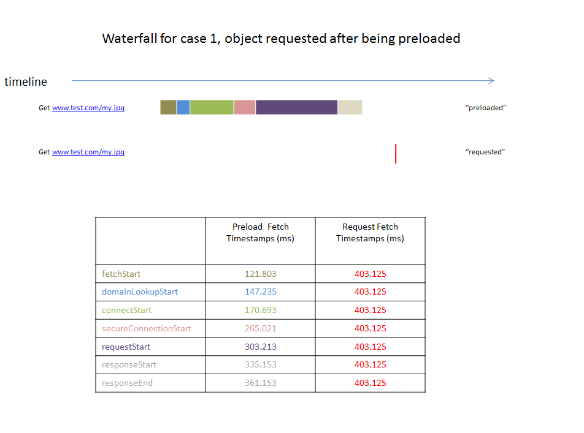
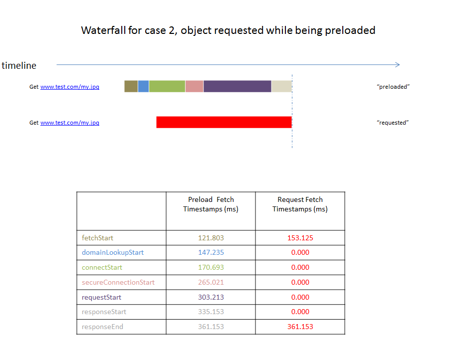

Insert Preload Hits to Waterfall Charts
========================================
:author: Fan Hu
:email: Fan.Hu@viasat.com

:date: 2014-09-12

The purpose of this document is to define how preloaded resources (https://igrigorik.github.io/resource-hints) will appear in waterfall charts when the
browser decided to use them given timing values as specified in http://www.w3.org/TR/resource-timing/#dom-performanceresourcetiming-fetchstart.

There are two different situations where preload resources will be used by the browser.

Case Number One
---------------

The hint is used (requested) after the hint has already been completely downloaded. As per step 3.5 in http://www.w3.org/TR/resource-timing/#processing-model, fetchStart will be set when the object is requested and domainLookupStart and connectStart will be the same value as fetchStart. The other timing parameters are not set in this case and so have a value of 0. The preload hit will appear as a thin line of a distinct color (red in this example) in the waterfall to chart to indicate when the preloaded resource was used by the browser.

.Figure  1 Requested after being preloaded

Case Number Two 
---------------

The hint is requested while the preloaded resource is still being downloaded. The fetchStart timestamp of the requested resource in this case should be the actual fetchStart time of the request as in case number one but in this case the responseEnd timestamp will be set to the same value as the preloaded resource.  This match on milliseconds to thousandths of a millisecond accuracy indicates that the two records used the same fetched resource as per this dicussion: https://github.com/igrigorik/resource-hints/issues/19#issuecomment-54350393. All other timestamps should be filled with zero. And the preload hit will appear as a single waterfall 
bar of specific color(such as red) in the waterfall chart as an indication that the requested resource was fulfilled by a preloaded resource.

.Figure  2 Requested during being preloaded

